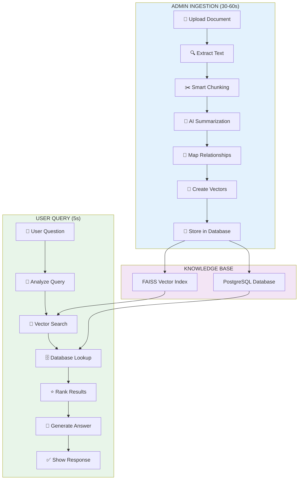

# Pragya Methodology - Visual Flowchart Guide

## 🎨 **For PowerPoint/Draw.io Creation**

Use this guide to create a professional flowchart diagram.

---

## 📐 **Layout Structure**

```
┌─────────────────────────────────────────────────────────────────────┐
│                         PRAGYA METHODOLOGY                          │
│              Intelligent Legal Document Search System              │
└─────────────────────────────────────────────────────────────────────┘

┌──────────────────────────┐         ┌──────────────────────────┐
│   ADMIN INGESTION        │         │    USER QUERY (RAG)      │
│   (One-time: 30-60s)     │         │    (Every query: 5s)     │
└──────────────────────────┘         └──────────────────────────┘
```

---

## 🔵 **LEFT COLUMN: ADMIN INGESTION PHASE**

**Color Scheme:** Blue gradient (light to dark)

### **Step 1: Document Upload** 📄
```
┌─────────────────────┐
│  📄 UPLOAD DOC      │
│  • PDF/TXT/HTML     │
│  • Section number   │
│  • Binding status   │
└──────────┬──────────┘
           │
           ▼
```

### **Step 2: Text Extraction** 🔍
```
┌─────────────────────┐
│  🔍 EXTRACT TEXT    │
│  • Parse document   │
│  • Clean format     │
│  • Verify quality   │
└──────────┬──────────┘
           │
           ▼
```

### **Step 3: Intelligent Chunking** ✂️
```
┌─────────────────────┐
│  ✂️ SMART CHUNKS    │
│  • Parent chunk     │
│  • Child chunks     │
│  • Relationships    │
└──────────┬──────────┘
           │
           ▼
```

### **Step 4: AI Summarization** 🧠
```
┌─────────────────────┐
│  🧠 AI SUMMARIZE    │
│  • Generate summary │
│  • Extract keywords │
│  • Key concepts     │
└──────────┬──────────┘
           │
           ▼
```

### **Step 5: Relationship Mapping** 🔗
```
┌─────────────────────┐
│  🔗 MAP RELATIONS   │
│  • Cross-references │
│  • "Clarifies" links│
│  • Citation graph   │
└──────────┬──────────┘
           │
           ▼
```

### **Step 6: Vector Embedding** 🔢
```
┌─────────────────────┐
│  🔢 CREATE VECTORS  │
│  • Text → Numbers   │
│  • AI embeddings    │
│  • FAISS index      │
└──────────┬──────────┘
           │
           ▼
```

### **Step 7: Database Storage** 💾
```
┌─────────────────────┐
│  💾 STORE IN DB     │
│  • PostgreSQL       │
│  • Indexed          │
│  • Ready to search  │
└─────────────────────┘
```

---

## 🟢 **RIGHT COLUMN: USER QUERY (RAG) PHASE**

**Color Scheme:** Green gradient (light to dark)

### **Step 1: User Question** 👤
```
┌─────────────────────┐
│  👤 ASK QUESTION    │
│  "What are the      │
│   requirements for  │
│   independent       │
│   director?"        │
└──────────┬──────────┘
           │
           ▼
```

### **Step 2: Question Analysis** 🔎
```
┌─────────────────────┐
│  🔎 ANALYZE QUERY   │
│  • Question type    │
│  • Key terms        │
│  • Intent detection │
└──────────┬──────────┘
           │
           ▼
```

### **Step 3: Semantic Search** 🎯
```
┌─────────────────────┐
│  🎯 VECTOR SEARCH   │
│  • Convert to vector│
│  • Search FAISS     │
│  • Find top 15      │
└──────────┬──────────┘
           │
           ▼
```

### **Step 4: Database Lookup** 🗄️
```
┌─────────────────────┐
│  🗄️ GET DETAILS     │
│  • Chunk text       │
│  • Section numbers  │
│  • Citations        │
└──────────┬──────────┘
           │
           ▼
```

### **Step 5: Relevance Ranking** ⭐
```
┌─────────────────────┐
│  ⭐ RANK & FILTER   │
│  • Sort by score    │
│  • Prioritize law   │
│  • Select top 5     │
└──────────┬──────────┘
           │
           ▼
```

### **Step 6: AI Answer Generation** 🤖
```
┌─────────────────────┐
│  🤖 GENERATE ANSWER │
│  • Read chunks      │
│  • Synthesize       │
│  • Add citations    │
└──────────┬──────────┘
           │
           ▼
```

### **Step 7: Response Delivery** ✅
```
┌─────────────────────┐
│  ✅ SHOW ANSWER     │
│  • Cited response   │
│  • Source sections  │
│  • Verification     │
└─────────────────────┘
```

---

## 🎯 **CENTER: KNOWLEDGE BASE**

**Place between the two columns, connecting both**

```
        ┌───────────────────────────┐
        │   💾 KNOWLEDGE BASE       │
        │                           │
        │  ┌─────────────────────┐  │
        │  │  PostgreSQL DB      │  │
        │  │  • Text & Metadata  │  │
        │  └─────────────────────┘  │
        │                           │
        │  ┌─────────────────────┐  │
        │  │  FAISS Index        │  │
        │  │  • Vector Search    │  │
        │  └─────────────────────┘  │
        │                           │
        │  11 Specialized Tables    │
        │  Governance-Grade Schema  │
        └───────────────────────────┘
              ▲              │
              │              │
        (Ingestion)    (Retrieval)
```

---

## 📊 **PowerPoint Creation Guide**

### **Slide Layout:**
1. **Title:** "Pragya Methodology - Two-Phase System"
2. **Two columns:** Admin Ingestion (left) | User Query (right)
3. **Center element:** Knowledge Base (connecting both)
4. **Footer:** Performance metrics

### **Color Scheme:**
- **Admin Ingestion:** Blue (#0066CC → #003366)
- **User Query:** Green (#00AA66 → #006633)
- **Knowledge Base:** Purple (#6633CC)
- **Arrows:** Gray (#666666)
- **Background:** White (#FFFFFF)

### **Icons to Use:**
- 📄 Document upload
- 🔍 Magnifying glass (search/extract)
- ✂️ Scissors (chunking)
- 🧠 Brain (AI)
- 🔗 Chain links (relationships)
- 🔢 Numbers/matrix (vectors)
- 💾 Database cylinder
- 👤 Person (user)
- 🎯 Target (search)
- ⭐ Star (ranking)
- 🤖 Robot (AI generation)
- ✅ Checkmark (completion)

### **Fonts:**
- **Title:** Calibri Bold, 28pt
- **Step headers:** Calibri Bold, 16pt
- **Step details:** Calibri Regular, 12pt
- **Timing labels:** Calibri Italic, 10pt

---

## 📏 **Dimensions for PowerPoint**

```
Slide Size: 16:9 (Standard)
Total Width: 10 inches
Total Height: 7.5 inches

Left Column (Ingestion):
  - X: 0.5 inches
  - Width: 3.5 inches
  - 7 boxes, each 0.8 inches tall

Right Column (Query):
  - X: 6 inches
  - Width: 3.5 inches
  - 7 boxes, each 0.8 inches tall

Center (Knowledge Base):
  - X: 4.25 inches (centered)
  - Width: 1.5 inches
  - Height: 3 inches
```

---

## 🎨 **Alternative: Mermaid Diagram Code**

If you want to use Mermaid (for markdown/web):



---

## 📋 **Quick Copy-Paste for Draw.io**

1. Open draw.io
2. Use "Flowchart" shapes
3. Copy the structure from the ASCII diagrams above
4. Apply the color scheme
5. Add icons from draw.io library
6. Export as PNG/SVG

---

## ✅ **Final Checklist**

- [ ] Two clear columns (Ingestion vs Query)
- [ ] 7 steps in each column
- [ ] Central Knowledge Base component
- [ ] Arrows showing flow direction
- [ ] Timing labels (30-60s vs 5s)
- [ ] Professional color scheme
- [ ] Clear, readable fonts
- [ ] Icons for visual appeal
- [ ] White background for printing
- [ ] High contrast for projector

---

**This guide provides everything needed to create a professional flowchart in PowerPoint, Draw.io, or any diagramming tool!** 🎯
